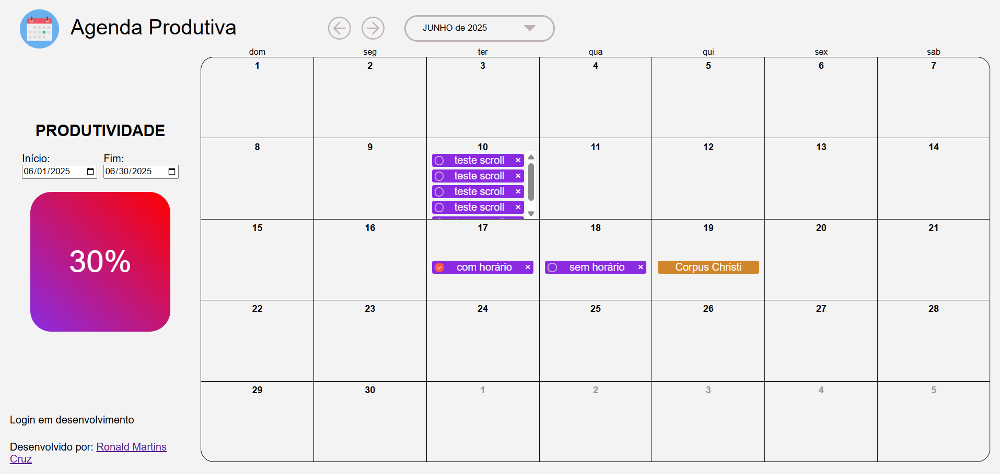
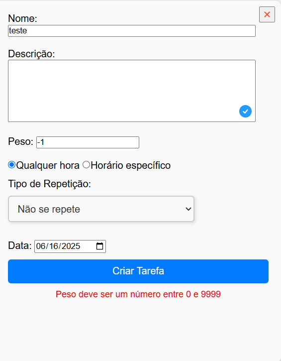

# Agenda Produtiva

Uma aplicação web inspirada no Google Calendar, desenvolvida com PHP e JavaScript, que permite criar, visualizar e gerenciar tarefas com funcionalidades extras como atribuição de pesos e marcação de conclusão e cálculo de produtividade.

O cálculo de produtividade é feito fazenddo a divisão entre a soma dos pesos das tarefas e a soma dos pesos das tarefas concluidas

🔗 [Acesse o projeto online](https://agenda-production-0ec4.up.railway.app/)

---

## 🚀 Funcionalidades

- ✅ Criação de tarefas com data e horário
- ⚖️ Atribuição de pesos às tarefas
- ✔️ Marcar tarefas como concluídas
- 📊 Cálculo de produtividade
- 📆 Visualização por data
- 💾 Backend com PHP e MySQL para persistência dos dados
- 🎉 Exibição de feriados nacionais
- 🛡️ Validação de formulário
- 🧠 Interface simples e direta, inspirada no Google Calendar


---

## 🛠️ Tecnologias utilizadas

### Frontend
- HTML
- CSS
- JavaScript

### Backend
- PHP
- MySQL

---

## 🔮 Funcionalidades futuras

- 🔒 Sistema de login de usuários  
- 🔁 Tarefas recorrentes (diárias, semanais, etc.)  
- 📱 Responsividade para dispositivos móveis  

## 📸 Imagens





## 🧪 Como executar localmente

> Requisitos: PHP 7+ e MySQL

1. Clone este repositório:

```bash
git clone https://github.com/Ronald-Martins-Cruz/agenda.git
```

2. Abra o XAMPP e inicie o Apache e o MySQL

3. Vá em
```bash
http://localhost/phpmyadmin/
```

4. Execute o script que está no arquivo script.sql da pasta aDocumentacao.

5. Troque o arquivo conexao.php da pasta controller pelo arquivo conexao.php da pasta aDocumentacao.

6. Inicie o servidor php:
```bash
php -S localhost:8000
```

7. No navegador acesse
```bash
http://localhost:8000
```